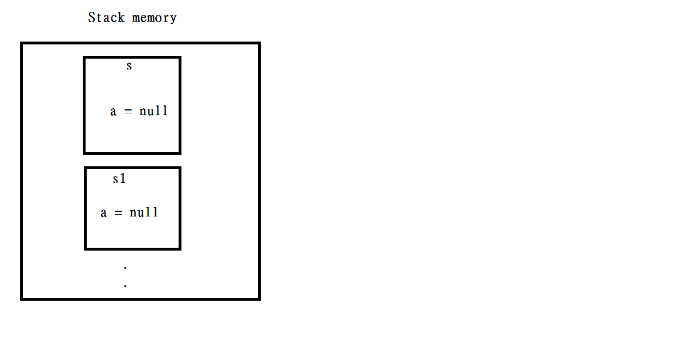
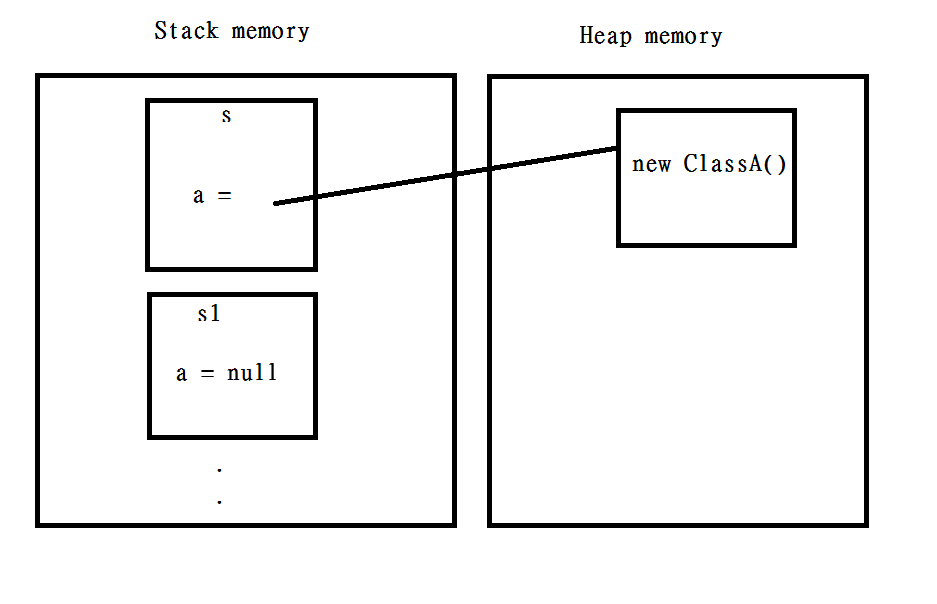
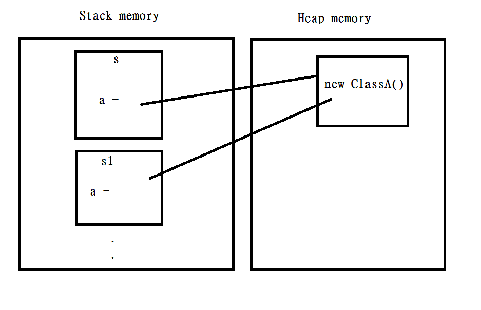
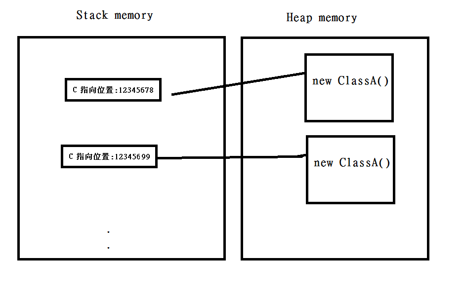

# Struct **V.S** Class

---

*Struct*和*Class*基本上一樣

除了...

| **不同之處**   | Struct            | Class                   |
| :------------: | :---------------: | :---------------------: |
| **型態**       | 值類型            | 參考類型                |
| **放置記憶體** | Stack上           | Heap上                  |
| **繼承**       | 只能實現Interface | 可繼承也可實現Interface |
| **NULL**       | 不能NULL          | 可為NULL              |

---

## 幾個範例來說明：Struct和Class存放記憶體位置

    public class ClassA
    {

    }

    public struct StructType 
    {
        public ClassA a { get; set; }
    }

## (Struct)範例一：

`Equals` 方法比較存放在*Stack*執行個體是否一樣

創建兩個 *Struct* 物件，並且比較可以得到 **True**

    [TestMethod]
    public void StructEquals1()
    {
        StructType s = new StructType();
        StructType s1 = new StructType();
        Assert.IsTrue(s.Equals(s1));
    }

`s`和`s1`的 Value都是一樣

如下圖：

## (Struct)範例二：

    [TestMethod]
    public void StructEquals2()
    {
        StructType s = new StructType();
        StructType s1 = new StructType();

        s.a = new ClassA();

        Assert.AreEqual(s.Equals(s1),false);
    }

`s.a`動態配置一個記憶體位置 而 `s1.a`並沒有 

所以兩個的Value不一樣

如下圖：

## (Struct)範例三：

    [TestMethod]
    public void StructEquals3()
    {
        StructType s = new StructType();
        StructType s1 = new StructType();

        ClassA aObj = new ClassA();

        s.a = aObj;
        s1.a = aObj;

        Assert.IsTrue(s.Equals(s1));
    }

宣告一個物件 `aObj` 並把 `s.a`,`s1.a`都指向他

所以兩個的Value一樣

如圖：

## (Class)範例：

    [TestMethod]
    public void ClassEqualsTest()
    {
        ClassType c = new ClassType();
        ClassType c1 = new ClassType();

        Assert.AreEqual(c.Equals(c1),false);
    }

可看到`c`和`c1`都指向不同記憶體位置

`AreEqual`方法比較 Stack上指向記憶體位置是否相同

**結果是不同!!**

如圖：

---

## 小結

Heap和Stack記憶體存放方式在其他語言中都是通用的概念，可說相當重要！！

另外如果想了解更多*Struct*和*Class*細節可看看小弟之前寫的 [記憶體Heap，Stack解說][1] 

[Github連結][2] 

  [1]: https://dotblogs.com.tw/daniel/2017/10/20/174725        "Heap 參考類型 V.S Stack 值類型 ??" 
  [2]: https://github.com/isdaniel/BlogSample/tree/master/src/Samples/StructAndClass     "Github連結"